# 

# Heritage Housing Issues - House Price Prediction

## Dataset Content

- The dataset is sourced from [Kaggle](https://www.kaggle.com/codeinstitute/housing-prices-data). A fictitious business case was created to demonstrate how predictive analytics can be applied in a real-world scenario.
- The dataset contains nearly 1,500 housing records from Ames, Iowa. It includes house attributes (floor area, basement, garage, kitchen quality, lot size, porch, wood deck, year built, etc.) and the corresponding sale price for houses built between 1872 and 2010.

| Variable      | Meaning                                                    | Units / Values                     |
| :------------ | :--------------------------------------------------------- | :--------------------------------- |
| 1stFlrSF      | First floor square feet                                    | 334 - 4692                         |
| 2ndFlrSF      | Second-floor square feet                                   | 0 - 2065                           |
| BedroomAbvGr  | Bedrooms above grade (does NOT include basement bedrooms)  | 0 - 8                              |
| BsmtExposure  | Walkout or garden level walls                              | Gd, Av, Mn, No, None               |
| BsmtFinType1  | Rating of basement finished area                           | GLQ, ALQ, BLQ, Rec, LwQ, Unf, None |
| BsmtFinSF1    | Type 1 finished square feet                                | 0 - 5644                           |
| BsmtUnfSF     | Unfinished square feet of basement area                    | 0 - 2336                           |
| TotalBsmtSF   | Total square feet of basement area                         | 0 - 6110                           |
| GarageArea    | Size of garage in square feet                              | 0 - 1418                           |
| GarageFinish  | Interior finish of the garage                              | Fin, RFn, Unf, None                |
| GarageYrBlt   | Year garage was built                                      | 1900 - 2010                        |
| GrLivArea     | Above grade (ground) living area square feet               | 334 - 5642                         |
| KitchenQual   | Kitchen quality                                            | Ex, Gd, TA, Fa, Po                 |
| LotArea       | Lot size in square feet                                    | 1300 - 215245                      |
| LotFrontage   | Linear feet of street connected to property                | 21 - 313                           |
| MasVnrArea    | Masonry veneer area in square feet                         | 0 - 1600                           |
| EnclosedPorch | Enclosed porch area in square feet                         | 0 - 286                            |
| OpenPorchSF   | Open porch area in square feet                             | 0 - 547                            |
| OverallCond   | Rates the overall condition of the house                   | 1 - 10                             |
| OverallQual   | Rates the overall material and finish of the house         | 1 - 10                             |
| WoodDeckSF    | Wood deck area in square feet                              | 0 - 736                            |
| YearBuilt     | Original construction date                                 | 1872 - 2010                        |
| YearRemodAdd  | Remodel date (same as construction date if no remodelling) | 1950 - 2010                        |
| SalePrice     | Sale price                                                 | 34900 - 755000                     |

---

## Business Requirements

A client has inherited four houses in Ames, Iowa, and wants support in maximizing the sales price of these properties. The client has access to a public dataset containing house prices and attributes from Ames, Iowa, and would like to use it to make informed decisions.

The client requires:

1. **Data Visualization and Correlation Study**  
   The client is interested in understanding how house attributes correlate with sale price. Therefore, the client expects visualizations of the most correlated variables against SalePrice.

2. **House Sale Price Prediction**  
   The client is interested in predicting the sale price of the four inherited houses, as well as any other house in Ames, Iowa.

## Project Hypotheses and Validation Plan

- **Hypothesis 1: House Size**  
  Houses with a larger above-ground living area (GrLivArea) tend to have higher sale prices.  
  This will be validated using scatter plots of GrLivArea vs SalePrice and by calculating Pearson correlation.

- **Hypothesis 2: Age of the House**  
  Newer houses tend to have higher sale prices than older houses.  
  This will be validated by creating a house age feature (based on YearBuilt), visualizing its relationship with SalePrice, and analyzing correlations and grouped summary statistics.

- **Hypothesis 3: Kitchen Quality**  
  Houses with higher kitchen quality (KitchenQual) tend to have higher sale prices.  
  This will be validated using boxplots comparing SalePrice across kitchen quality categories and calculating mean SalePrice per category.

## The Rationale to Map the Business Requirements to the Data Visualisations and ML Tasks

- **Business Requirement 1: Data Visualisation and Correlation Study**  
  Correlation analysis and visualizations (scatter plots, boxplots, and heatmaps) will be used to identify the house attributes most strongly associated with SalePrice. This helps translate raw housing data into actionable insights and supports feature selection for model training.

- **Business Requirement 2: Predictive Modelling**  
  A supervised regression machine learning model will be developed to predict SalePrice based on housing attributes. This enables the client to estimate the value of the inherited houses and provides a tool for predicting prices of other houses in Ames, Iowa.

## ML Business Case

### What are the business requirements?

- Identify which house attributes are most correlated with SalePrice through analysis and visualization.
- Predict sale prices for the four inherited houses and any other property in Ames, Iowa.

### Can conventional data analysis answer part of the business requirements?

Yes. Correlation studies, visualizations, and summary statistics can be used to understand which variables influence SalePrice.

### Does the client need a dashboard or an API endpoint?

The client requires a dashboard to explore insights and generate predicted house prices.

### What does the client consider a successful project outcome?

- A study showing the most relevant variables correlated to SalePrice.
- A model capable of predicting sale prices for the four inherited houses and other houses in Ames, Iowa.

### Epics and User Stories

- **Epic 1: Data Collection and Understanding**  
  User Story: As a client, I want housing data so that I can understand which factors influence house prices.

- **Epic 2: Data Cleaning and Preparation**  
  User Story: As a data analyst, I want to clean and prepare the dataset so that it is suitable for analysis and machine learning.

- **Epic 3: Data Visualization and Correlation Study**  
  User Story: As a client, I want visual insights showing which house attributes correlate with sale price.

- **Epic 4: Model Training and Evaluation**  
  User Story: As a client, I want a reliable model that predicts house sale price so I can estimate the value of the inherited properties.

- **Epic 5: Dashboard Development**  
  User Story: As a user, I want an interactive dashboard so I can explore insights and generate predictions.

- **Epic 6: Deployment**  
  User Story: As a client, I want the dashboard deployed so I can access the system easily.

### Ethical or Privacy Concerns

No major ethical or privacy concerns are expected, as the dataset is publicly available and does not contain sensitive personal information.

### Does the data suggest a particular model?

Yes. Since SalePrice is a continuous numeric variable, the problem is best approached using supervised regression models.

### What are the model inputs and intended outputs?

- **Inputs:** House attributes (for example: GrLivArea, YearBuilt, GarageArea, KitchenQual, etc.)
- **Output:** Predicted SalePrice

### Performance Goal

The agreed performance goal is an **R² score of at least 0.75** on both the training and test sets.

### How will the client benefit?

The client will benefit by being able to estimate the market value of the inherited properties and maximize potential sale prices using reliable predictive insights.

## Dashboard Expectations

The dashboard will include:

- **Project Summary Page**  
  Dataset overview and client requirements.

- **Correlation Study Page**  
  Visual findings showing which variables are most correlated with SalePrice.

- **Inherited House Price Prediction Page**  
  Displays the four inherited houses’ attributes and predicted sale price for each, including the summed predicted total.

- **House Price Prediction Tool**  
  Interactive widgets allowing users to input house attributes and generate real-time sale price predictions.

- **Hypothesis and Validation Page**  
  Lists project hypotheses and explains how they were tested.

- **Technical Page**  
  Displays model performance metrics and the deployed pipeline steps.

## Dashboard Design

The Streamlit dashboard was designed to allow the client to explore the dataset, understand the key factors influencing house sale prices, and generate real-time predictions for the four inherited houses and any other property in Ames, Iowa.

The dashboard contains the following pages:

### Page 1: Project Summary

**Purpose:** Provide an overview of the project and the client requirements.

**Content:**

- Project introduction and business context
- Dataset description and source information
- Summary of the two main business requirements
- Overview of the workflow (data analysis, modeling, and prediction system)

The summary page gives the user a clear understanding of the project scope and objectives before exploring deeper insights.

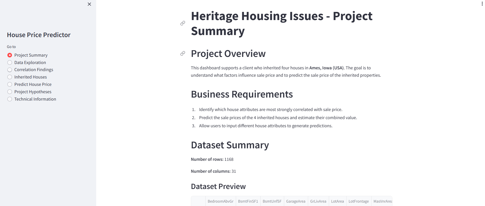

### Page 2: Correlation Study and Data Insights

**Purpose:** Identify which house attributes are most strongly associated with SalePrice.

This page helps the client understand which features have the greatest impact on house value.

**Content:**

- Correlation heatmap showing relationships between numerical features and SalePrice
- Table of top positively and negatively correlated variables
- Scatter plots showing key relationships (e.g., GrLivArea vs SalePrice)
- Boxplots showing categorical feature impact (e.g., KitchenQual vs SalePrice)
- Summary of key findings

The correlation analysis highlights the most influential predictors of house price.

The heatmap below shows the strength of relationships between all numerical variables and SalePrice.

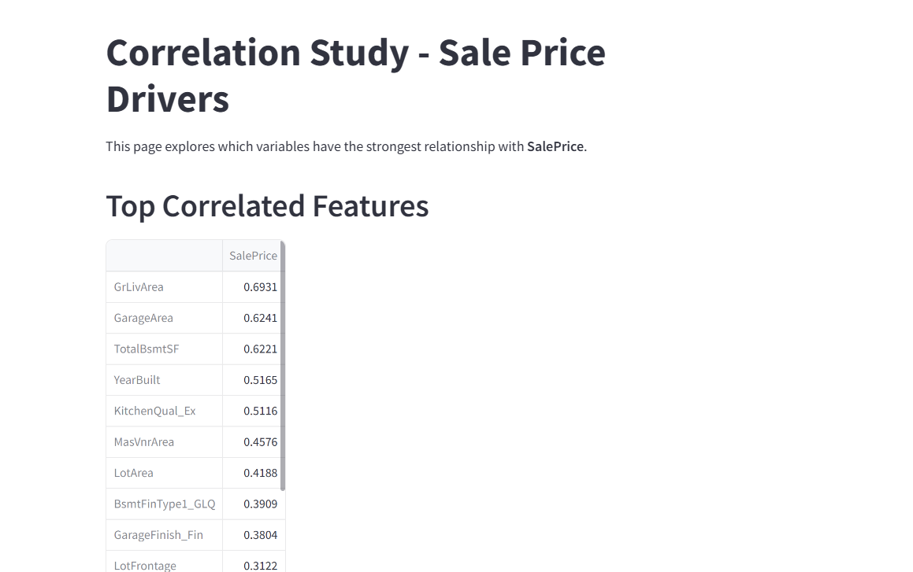

The second visualization provides additional correlation insights and confirms key feature relationships.

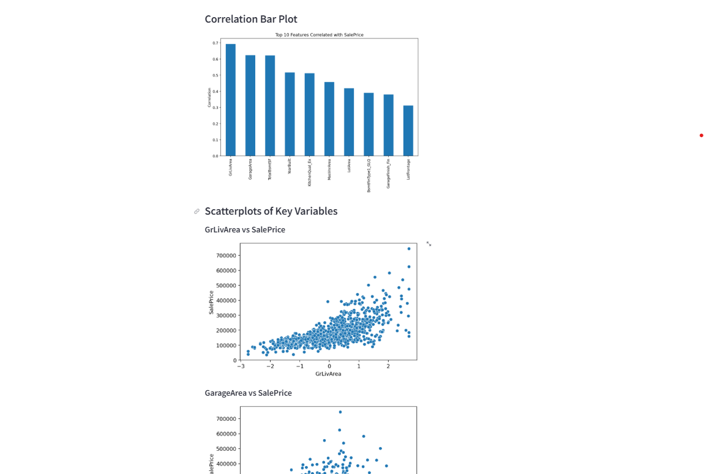

### Page 3: Inherited House Price Predictions

**Purpose:** Display predicted sale prices for the four inherited houses and their combined value.

This page provides the main business output of the project.

**Content:**

- Table of inherited house attributes
- Predicted SalePrice for each house
- Total combined predicted value for all four houses
- Explanation of prediction method

This allows the client to directly understand the financial value of the inherited properties.

The visualization below shows the predicted values generated by the trained ML pipeline.

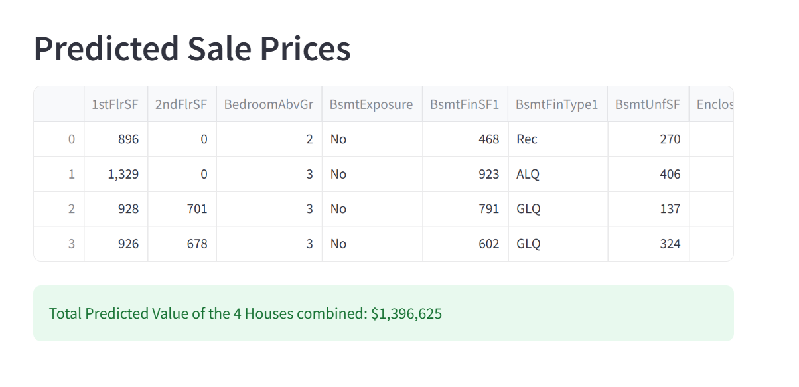

### Page 4: House Price Prediction Tool (Interactive)

**Purpose:** Allow users to input house features and receive real-time price predictions.

This page enables dynamic testing of different house configurations.

**Content:**

- Sliders for numeric inputs (e.g., GrLivArea, LotArea, GarageArea)
- Dropdowns for categorical inputs (e.g., KitchenQual, GarageFinish)
- Prediction button
- Output displaying estimated SalePrice

Users can explore how changing house features affects predicted value.

The interface below shows the interactive prediction tool.

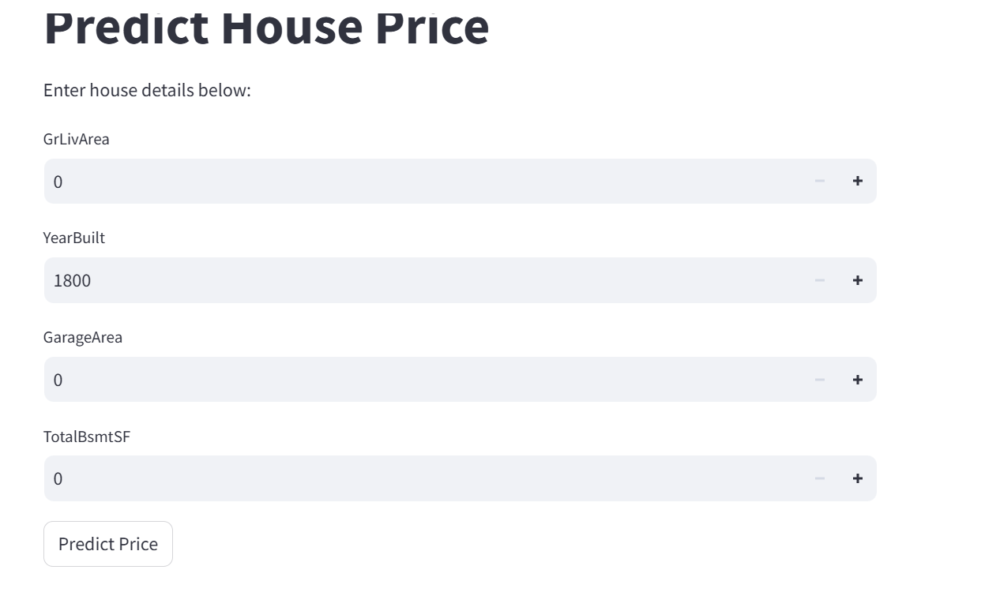

### Page 5: Project Hypotheses and Validation

**Purpose:** Show how hypotheses were tested using data analysis.

This page connects business assumptions with actual data evidence.

**Content:**

- Hypotheses list (size, age, kitchen quality)
- Supporting visualizations (scatter plots, boxplots, grouped statistics)
- Conclusions on whether each hypothesis is supported

This page demonstrates how data analysis validates business assumptions.

The image below shows the hypothesis validation dashboard.

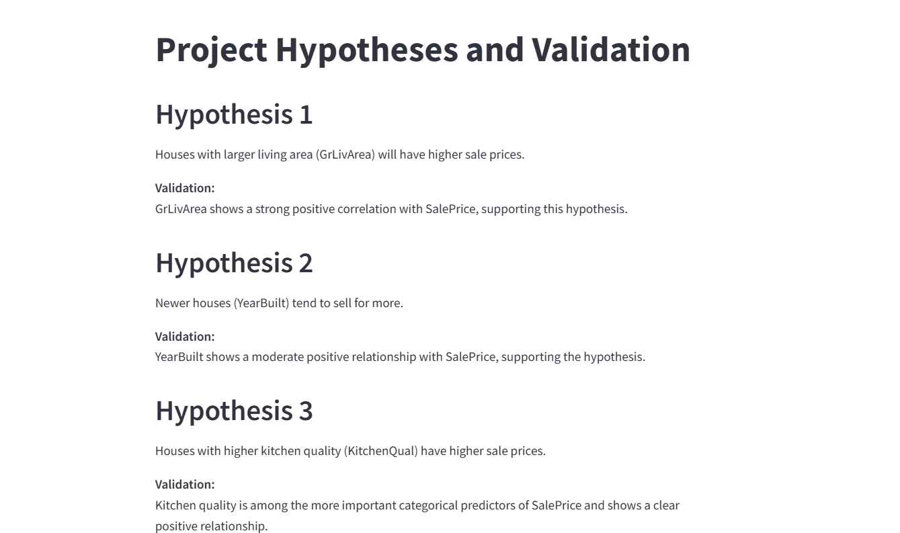

### Page 6: Model Performance and Pipeline

**Purpose:** Present model evaluation results and technical transparency.

This page ensures the model meets the required performance standards.

**Content:**

- MAE, RMSE, and R² score
- Model type (Gradient Boosting Regressor)
- Pipeline steps (preprocessing + model training)
- Comparison against success criteria

This page confirms the reliability and performance of the prediction system.

The image below shows the technical performance of the trained model.

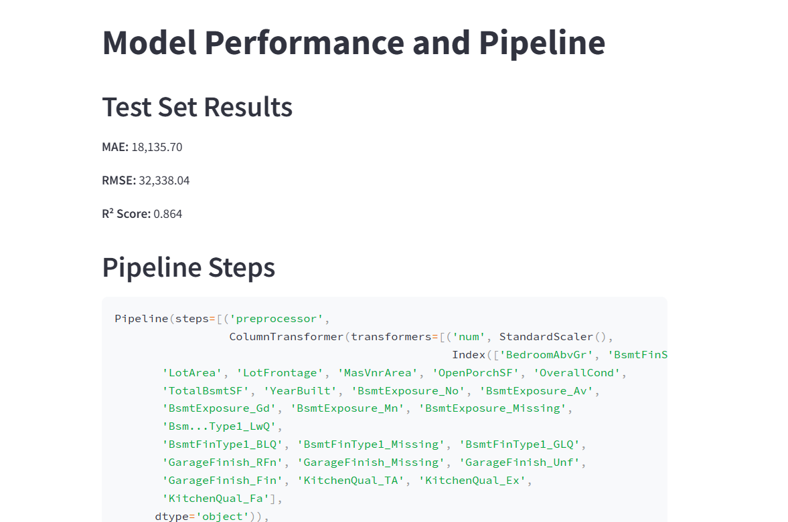

## Unfixed Bugs and Limitations

During development, several modelling limitations and trade-offs were identified. These were not left unresolved due to oversight, but rather reflect deliberate design choices made during feature engineering and model optimisation to balance performance, interpretability, and data constraints.

### 1. Data Cleaning

I referenced a solution from [StackOverflow](https://stackoverflow.com/questions/42027862/prevent-pandas-from-reading-none-as-nan) to address an issue where Pandas was interpreting `None` values as `NaN`, which incorrectly suggested that missing values were already present in the dataset.

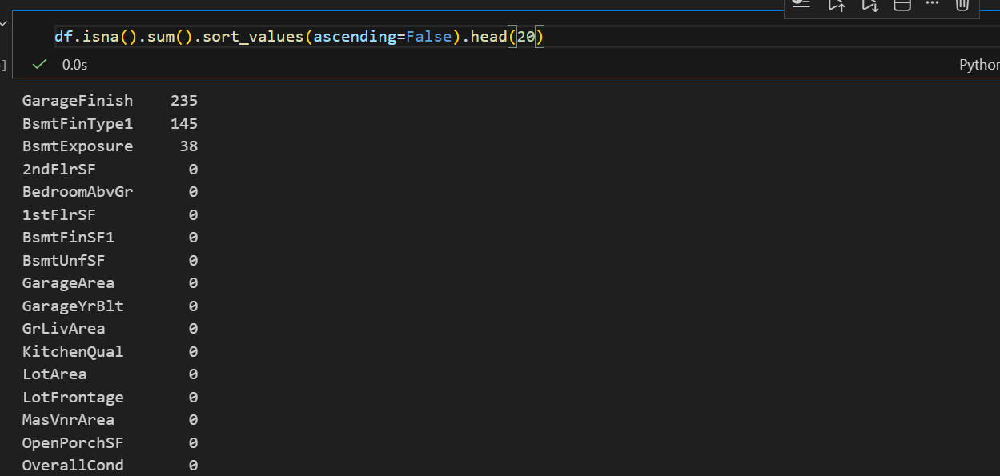

Using this guidance, I replaced `None` values with the string `"Missing"`, which prevented Pandas from automatically converting them to `NaN` and ensured more accurate data cleaning validation.

### 2. Skewness Reduction Using Log Transformations

Skewed numerical features were transformed using `np.log1p` to improve distribution symmetry and reduce the impact of extreme values. The choice of `np.log1p` (over `np.log`) was informed by its ability to handle zero values, as discussed in Afzal Butt (n.d.).

| Feature     | Original Skew | Log1p Skew |
| ----------- | ------------- | ---------- |
| GrLivArea   | 1.43          | 0.01       |
| LotArea     | 11.96         | -0.01      |
| TotalBsmtSF | 1.72          | -5.27      |
| 1stFlrSF    | 1.42          | 0.03       |
| BsmtFinSF1  | 1.86          | -0.62      |

This transformation significantly reduced skewness across all variables, improving suitability for regression modelling.

**Reference:** Afzal Butt, N. F. (n.d.). _Understanding np.log and np.log1p in NumPy_. Medium. https://medium.com/@noorfatimaafzalbutt/understanding-np-log-and-np-log1p-in-numpy-99cefa89cd30

### 3. Correlation Analysis Bug

While reviewing my correlation heatmap, my mentor pointed out an issue where `SalePrice` was appearing twice. This was caused by how I constructed my list of numeric features.

I initially selected all numeric columns using Pandas, which already included `SalePrice`, and then manually added `SalePrice` again when computing the correlation matrix.  
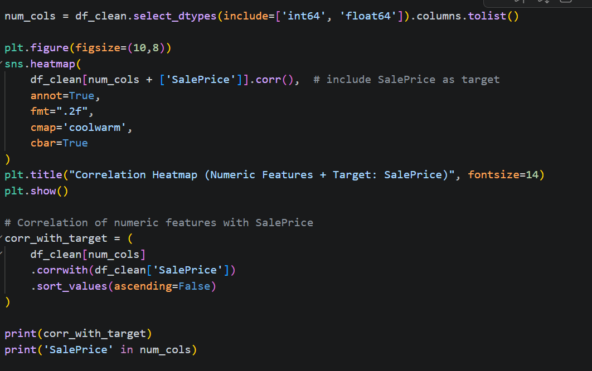

This resulted in duplicate rows and columns for `SalePrice` in the heatmap.  
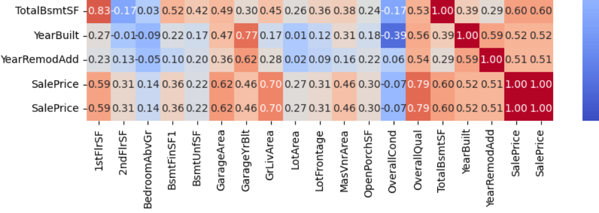

The duplication created redundant 1.00 correlations and made the visualization harder to interpret, potentially leading to confusion during feature analysis.

To fix this, I removed `SalePrice` from the numeric column list before appending it manually:

```python
num_cols = df_clean.select_dtypes(include=['int64', 'float64']).columns.tolist()
num_cols.remove('SalePrice')
```

### 4. Impact of Outliers After Winsorization

Outliers in numerical variables such as `GrLivArea`, `LotArea`, and `SalePrice` were addressed using winsorization.

- This reduced the influence of extreme values while preserving dataset integrity.
- However, some residual extreme values may still influence model predictions. Prediction error increases for higher-value houses due to fewer training examples in this range.

The plot shows that model prediction becomes less consistent at higher values.

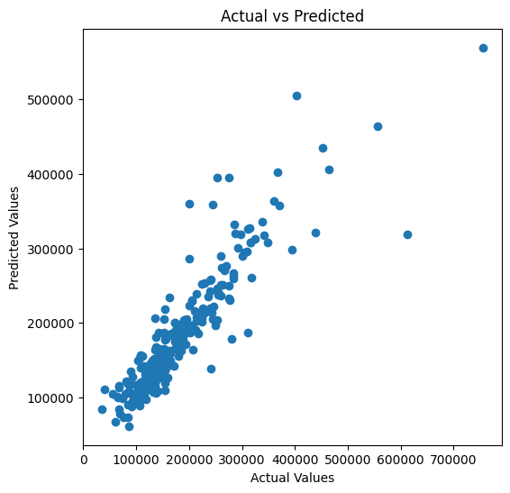

- More aggressive approaches such as full removal or heavy transformation were avoided to maintain representation of rare but valid luxury homes.

### 5. Residual Skewness in Numerical Features

Power transformations (Box-Cox / Yeo-Johnson) were applied to reduce skewness in selected numerical features.

- Power transformations reduced skewness in key numerical features, improving distribution symmetry and model stability.
  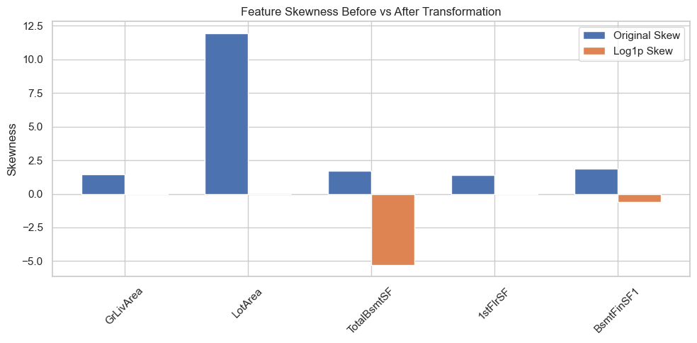

- However, not all variables could be fully normalised due to mixed distributions.
- As a result, some mild skewness remains in the dataset, which may slightly affect model assumptions.

### 6. Multicollinearity Trade-offs

Smart correlation selection reduced multicollinearity by removing highly redundant features, improving model efficiency.

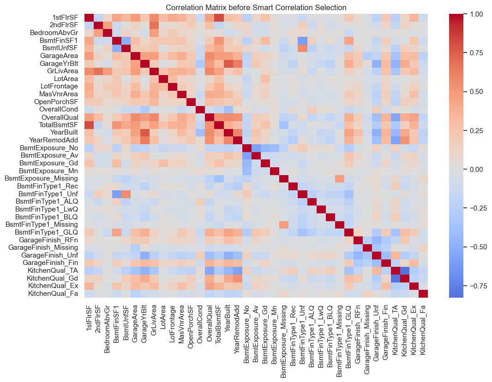

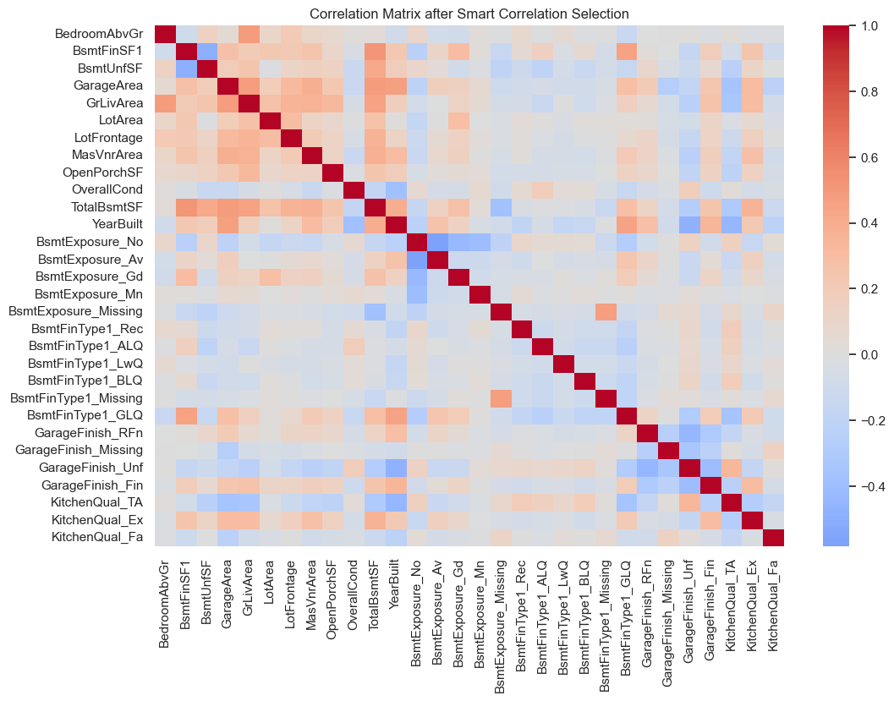

- Some correlated variables (e.g., GrLivArea and TotalBsmtSF) were intentionally retained to preserve interpretability.
- This introduces controlled redundancy while keeping meaningful, domain-relevant information.

Overall, this balances reduced multicollinearity with model interpretability.

### 7. Encoding Strategy Trade-offs

A combination of ordinal encoding and one-hot encoding was applied depending on feature type:

- Ordinal encoding was used for ordered categorical variables.
- One-hot encoding was used for nominal categorical variables.

- This improved model performance by allowing better representation of categorical features.
- However, it increased feature dimensionality and made individual features harder to interpret in the final model.

Overall, this reflects a trade-off between predictive performance and interpretability.

### 8. Performance on Extreme Property Values

Although preprocessing improved overall robustness, the model is still less accurate for extreme or atypical properties.

- This is due to limited representation of outlier cases in the training data.
- As a result, the model performs best on typical housing profiles, with higher error at the upper end of property values.

## Summary

The feature engineering pipeline addressed key data quality issues through systematic preprocessing, including encoding, transformation, outlier handling, and correlation filtering.

Remaining limitations are mainly due to:

- inherent dataset distribution constraints
- trade-offs between model performance and interpretability
- limited representation of extreme property values

Overall, the final model is a balanced solution aligned with the objective of accurate and generalisable house price prediction.

## Deployment

### Heroku

- The app live link is: https://housing-predictor-4875a00b4789.herokuapp.com/

- Ensure the `.python-version` file uses a Heroku-supported Python version (e.g. Python 3.11).
- The project was deployed to Heroku using the following steps.

1. Log in to Heroku and create an App
2. At the Deploy tab, select GitHub as the deployment method.
3. Select your repository name and click Search. Once it is found, click Connect.
4. Select the branch you want to deploy, then click Deploy Branch.
5. The deployment process should happen smoothly if all deployment files are fully functional. Click the button Open App on the top of the page to access your App.
6. If the slug size is too large then add large files not required for the app to the .slugignore file.

## Main Data Analysis and Machine Learning Libraries

### Data handling & computation

- **pandas** – data loading, cleaning, missing value handling, and feature engineering
- **numpy** – numerical operations, array transformations, and feature calculations
- **scipy** – statistical analysis, distributions, and skewness-related calculations


### Data visualization

- **matplotlib** – plotting graphs, feature distributions, and model evaluation visuals
- **seaborn** – statistical visualizations including heatmaps and distribution plots

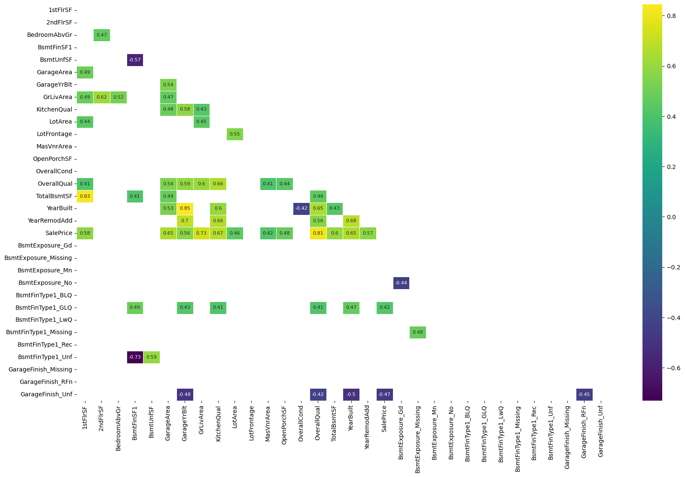

### Preprocessing & feature engineering

- **scikit-learn** – train/test splitting, scaling, pipelines, feature selection, and evaluation
- **feature-engine** – advanced preprocessing including encoding, outlier handling, and correlation-based feature selection
- **PowerTransformer (scikit-learn)** – stabilizing variance and improving feature normality

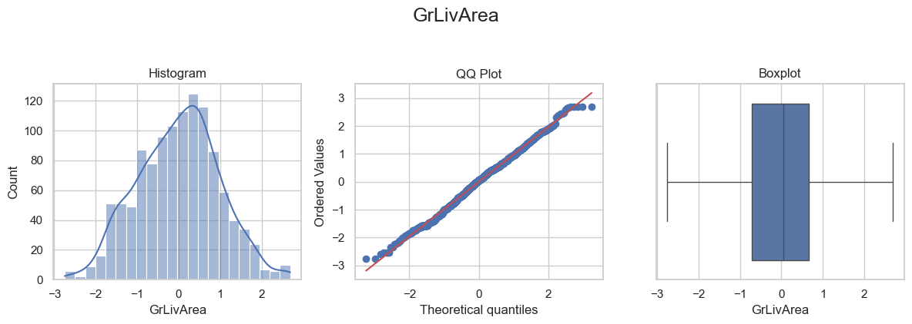

### Models & machine learning

- **scikit-learn models** – Linear Regression, Ridge, Lasso, Random Forest, Gradient Boosting, Extra Trees
- **XGBoost** – final high-performance regression model for predicting house sale prices

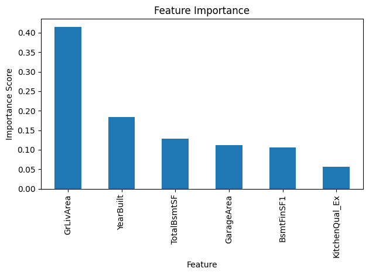

### Model evaluation & tuning

- **GridSearchCV** – hyperparameter tuning and cross-validation search
- **scikit-learn metrics** – MAE, RMSE, and R² scoring for model evaluation

### Pipeline & deployment support

- **Pipeline / ColumnTransformer** – end-to-end preprocessing and modeling workflow
- **joblib** – saving and loading trained models for reuse and deployment
- **pathlib / os / sys** – project path management and file handling across environments

### Data exploration

- **ydata-profiling** – automated exploratory data analysis report generation

For a detailed analysis of the dataset, including missing values, distributions, correlations, and more, check out the Exploratory Data Analysis (EDA) Report [here](https://david5p.github.io/heritage-housing/house_prices_report.html).
This report is generated using **ydata-profiling** and provides comprehensive insights into the dataset.

## Credits

### Code Institute Handbook: Heritage Housing Issues

- I used the [Code Institute Handbook: Heritage Housing Issues] https://github.com/Code-Institute-Solutions/milestone-project-heritage-housing-issues template for project structure and deployment setup.

### Churnometer Walkthrough Project

- I referred to the project as a guide for setting up my Jupyter notebooks.
- The feature engineering notebook workflow and custom transformation evaluation functions were adapted from the walkthrough.
- The modelling notebook workflow used in this project was adapted from this project. In particular, the regression benchmarking approach, the reusable pipeline-building function, and the custom `HyperparameterOptimizationSearch` class (used to run GridSearchCV across multiple candidate models and summarise cross-validation results) were originally developed in the Churnometer project and then modified for predicting **SalePrice** in the Heritage Housing dataset.

- I also followed the same steps for Heroku deployment as directed in the walkthrough project.

- I used StackOverflow a few times as mentioned in my Bugs section to help me resolve issues.

### External Resources Used During Development

The following resources were used to support development, debugging, and understanding of key concepts:

- [StackOverflow](https://stackoverflow.com/questions) — used for troubleshooting specific implementation issues and error resolution.
- [W3Schools](https://www.w3schools.com/) — used for quick reference and clarification of core programming concepts.
- [ChatGPT](https://chatgpt.com/) — ChatGPT was used as a support tool for debugging assistance, conceptual clarification, and code explanation during development.
